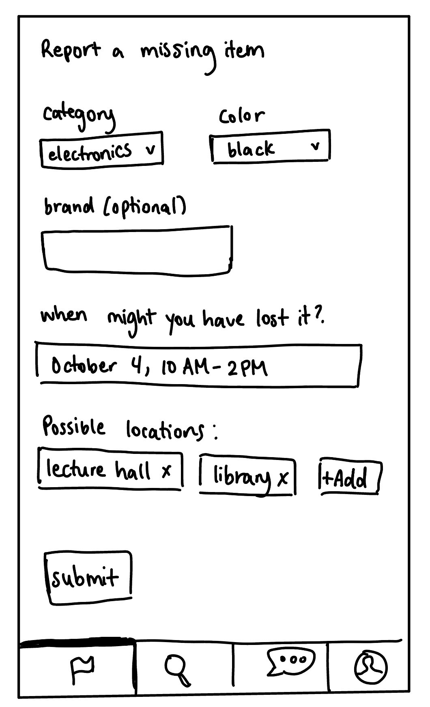
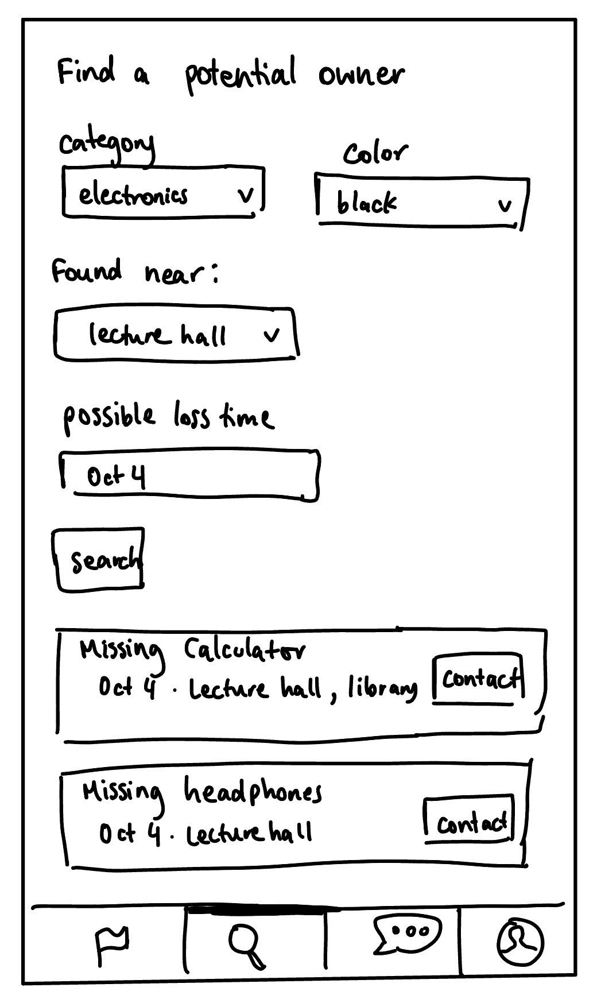
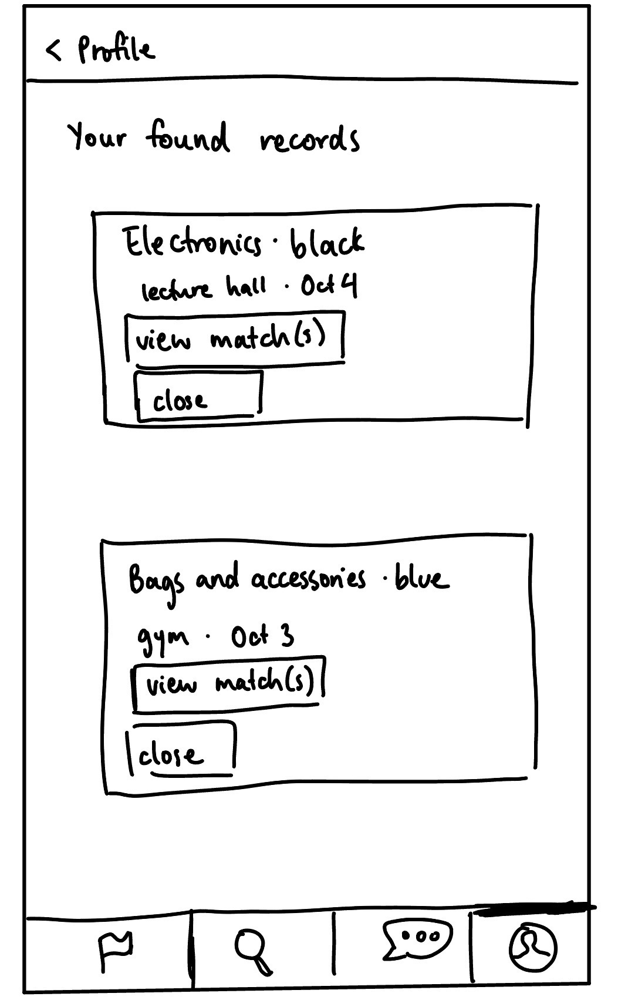

# P1: Design

## Problem Framing and Stakeholders

### Domain

Students at a large university move between classrooms, libraries, dining halls, dorms, and other campus spaces while carrying belongings such as keys, headphones, calculators, and jackets. They may not notice that something is missing until hours later, making it difficult to determine where they lost it.

Owners want to recover items that have financial, practical, or personal value. Finders may want to help but have limited time to locate the owner. Campus staff also assist by storing found property and responding to inquiries. Returning an item requires these people to connect, even when they use different channels or act at different times.

### Bad Situations

**Owners and finders use different channels.** A student loses headphones and checks with campus police, asks at the library, and posts in a dorm group chat. Meanwhile, another student has handed the headphones to a classroom building’s front desk. Neither student knows about the other’s actions. The owner spends time searching and may replace an item that is already waiting to be collected.

**Reports appear at different times.** A finder posts about a calculator before its owner notices the loss. By the time the owner searches or posts, the finder’s announcement is buried beneath newer posts. The finder does not continue monitoring for an owner, so the opportunity to reconnect is missed.

**Ownership claims are difficult to evaluate.** A public found-item post may reveal the appearance and identifying details of an item. Someone other than the owner could repeat those details when claiming it. Finders must balance providing enough information to help the owner recognize the item with retaining enough information to assess a claim.

### Corroboration

Online discussions illustrate these coordination problems. In a [New Zealand discussion](https://www.reddit.com/r/newzealand/comments/1t63oex/lost_and_found_app_for_nz/), a commenter described searching online for lost keys before later discovering that police held them. A [University of Alberta discussion](https://www.reddit.com/r/uAlberta/comments/1ow7jtp/found_airpods_by_plh/) described a finder waiting for an owner’s missing-item post and raised the concern that the owner might not use Reddit.

Ownership-checking procedures also demonstrate the need to assess claims. [MIT Police](https://police.mit.edu/lost-and-found) request identifying details, while [Charles Sturt University’s policy](https://policy.csu.edu.au/document/view-current.php?id=359) requires an identifying description and proof of identity. These procedures establish ownership verification as a concern, although they do not show how frequently false claims occur.

### Existing Approaches and Limitations

Retracing routes and contacting individual offices can recover items, but requires time and knowledge of where a finder might have taken them. Social media provides a familiar way to share reports, but posts can lose visibility and may not reach the relevant person.

Tracking services such as Apple’s Find My can help with supported devices or tagged belongings, but do not cover every lost item. Lost-and-found listing services can help people exchange information, but publishing a listing alone does not resolve differences in reporting time or the difficulty of evaluating ownership.

### Stakeholders

- **Owners of lost items:** Seek to recover their belongings while minimizing search time, replacement costs, and disruption.
- **Finders of unattended items:** Want a convenient way to locate the owner and return property to the correct person.
- **Campus front-desk and building staff:** Store found items and answer inquiries, often within separate building-level processes.
- **Campus police or central lost-and-found staff:** Receive and store property, respond to reports, and evaluate ownership claims before returning items.

## Application Pitch

### App name: Backtrack

**Motivation:** Backtrack helps students find lost belongings by connecting owners and finders in one per-campus application, even when they report an item at different times.

When we lose something, we tend to check multiple offices and group chats without knowing where to look. Backtrack gives owners one place to report a missing item and gives finders a convenient way to locate a potential owner. Some key features for this process include:

**Find the Owner.** Owners of lost items submit private missing-item reports describing their belongings, when they might have lost them, and possible locations. Finders enter characteristics of an item they have found and receive a short list of potential matches with limited information. This helps students connect without searching across unrelated social platforms.

**Match Later.** If no matching report exists, a finder can save a private record of the found item and get notified when a compatible missing-item report appears. So, owners and finders can connect even if the item is found before its owner notices the loss, without requiring the finder to repeatedly search for updates.

**Return and Earn.** Finders can message potential owners to discuss the item and arrange a handoff. After both participants confirm the return, the finder receives points for their contribution to encourage participation.

Owners and finders use their conversation to assess whether an item belongs to the claimant before arranging its return.

## Concept Specifications

### Authenticating

```text
**concept** Authenticating
**purpose** identify registered users
**principle**
  a user registers with a unique username and password;
  logging in creates a session identifying the user;
  logging out ends that session.

**state**
  a set of Users with
    a username String
    a passwordHash String
  a set of Sessions with
    a user User

**actions**
  register (username: String, password: String) : return (user: User)
    where username is unused and password is not empty
    then create and return a user with this username and
      a hash of this password

  login (username: String, password: String) : return (session: Session)
    where the credentials match an existing user
    then create and return a session for that user

  authenticate (session: Session) : return (user: User)
    where session exists
    then return its user

  logout (session: Session)
    where session exists
    then delete the session
```

### ItemReporting

```text
**concept** ItemReporting [User]
**purpose** record descriptions of missing and found items
**principle**
  a user creates a missing or found report;
  the author can read its attributes and update it;
  the author closes the report when it is no longer needed.

**state**
  a set of Reports with
    an author User
    a title String
    a kind Kind, either missing or found
    an attributes Attributes
    an open Flag

  Attributes contains
    a category String selected from:
      Electronics
      Keys and cards
      Clothing and accessories
      Bags
      Books and stationery
      Bottles and containers
      Other
    a set of colors of String
    an optional brand String
    a time interval
    a set of locations of String

**actions**
  create (author: User, kind: Kind, attributes: Attributes,
  title: String)
   : return (report: Report)
    where category and title is not empty and the time interval is valid
    then create and return an open report with the given values

  update (author: User, report: Report, attributes: Attributes,
  title: String)
    where report exists and is open, title nonempty, author is its author,
      and the supplied attributes are valid
    then replace its attributes and title

  readOwn (author: User, report: Report)
    : return (attributes: Attributes, title: String)
    where report exists and author is its author
    then return its attributes and title

  summary (report: Report)
    : return (category: String, interval: TimeInterval,
      locations: set of String, title: String)
    where report exists and is open
    then return its category, time interval, title, and locations

  close (author: User, report: Report)
    where report exists and is open, and author is its author
    then set open to false
```

### Matching

```text
**concept** Matching [Record]
**purpose** identify potentially corresponding records
**principle**
  records are registered in one of two groups;
  searching returns compatible records from the opposite group;
  compatible pairs are stored so matches can be retrieved later.

**state**
  a set of Entries with
    a record Record
    a group Group, either A or B
    an attributes Attributes
  a set of Pairs with
    a left Record from group A
    a right Record from group B

  Attributes contains category, colors, optional brand,
    a time interval, and locations.

  Records are compatible when their categories agree and their
    time intervals overlap. Colors and locations must overlap
    when both records supply them. Brand must agree
    when both records supply the respective value.

**actions**
  register (record: Record, group: Group, attributes: Attributes)
    where record is not registered and attributes are valid
    then register it and create pairs with compatible records
      in the opposite group

  search (group: Group, attributes: Attributes)
    : return (records: set of Record)
    where attributes are valid
    then return compatible records from the opposite group

  matches (record: Record) : return (records: set of Record)
    where record is registered
    then return the records paired with it

  update (record: Record, attributes: Attributes)
    where record is registered and attributes are valid
    then replace its attributes and recompute its pairs

  remove (record: Record)
    where record is registered
    then remove its entry and all pairs containing it
```

### Messaging

```text
**concept** Messaging [User]
**purpose** support private communication between participants
**principle**
  a conversation is created with participants;
  only those participants can send and read its messages.

**state**
  a set of Conversations with
    a set of participants of User
    a sequence of Messages
  a set of Messages with
    a sender User
    a text String

**actions**
  create (participants: set of User)
    : return (conversation: Conversation)
    where there are at least two participants
    then create and return a conversation with these participants
      and no messages

  send (sender: User, conversation: Conversation, text: String)
    where conversation exists, sender is a participant,
      and text is not empty
    then append a new message with this sender and text

  read (user: User, conversation: Conversation)
    : return (messages: sequence of Message)
    where conversation exists and user is a participant
    then return its messages
```

### ContributionRewarding

```text
**concept** ContributionRewarding [User, Contribution]
**purpose** recognize confirmed contributions
**principle**
  a contribution is registered with a contributor and recipient;
  both confirm that it occurred;
  the contributor receives one point, awarded only once.

**state**
  a set of Entries with
    a contribution Contribution
    a contributor User
    a recipient User
    a set of confirmations of User
    a rewarded Flag
  a point balance for each User, initially zero

**actions**
  register (contribution: Contribution, contributor: User,
    recipient: User)
    where contribution is not registered and contributor
      is not recipient
    then register it with these participants, no confirmations,
      and rewarded set to false

  confirm (user: User, contribution: Contribution)
    where contribution is registered and user is its contributor
      or recipient
    then add user to its confirmations;
      if both participants have confirmed and rewarded is false,
      add one point to the contributor's balance and set
      rewarded to true

  balance (user: User) : return (points: Number)
    then return the user's point balance
```

## Essential Reactions

Requesting represents user requests and application responses,
rather than a stored concept. Each session is authenticated before
performing user-directed actions. Conditions referring to authors,
kinds, participants, or confirmations are queries over concept state.

### 1. Register reports for matching

when
  Requesting.submitReport(session, kind, attributes, title)
where
  Authenticating.authenticate(session) returns user
then
  ItemReporting.create(user, kind, attributes, title)
    returns report
  Matching.register(report, A if kind is missing otherwise B,
    attributes)

Missing reports use group A and found records use group B.

### 2. Search for potential owners

when
  Requesting.searchForOwner(session, attributes)
where
  Authenticating.authenticate(session) returns user
  Matching.search(B, attributes) returns reports
then
  retrieve ItemReporting.summary(report) for each report
  respond with the summaries and report IDs

### 3. Retrieve later matches

when
  Requesting.viewMatches(session, foundReport)
where
  Authenticating.authenticate(session) returns finder
  foundReport is open, has kind found, and has author finder
  Matching.matches(foundReport) returns reports
then
  retrieve ItemReporting.summary(report) for each report
  respond with the summaries and report IDs

Matching maintains pairs when new reports appear, so saved found
records can acquire matches later. Results are shown inside the app.

### 4. Connect a finder and owner

when
  Requesting.contactOwner(session, missingReport, attributes)
where
  Authenticating.authenticate(session) returns finder
  Matching.search(B, attributes) returns a set containing missingReport
  missingReport is open and has kind missing
  missingReport has author owner, and finder is not owner
then
  Messaging.create({finder, owner}) returns conversation
  respond with conversation

For subsequent message requests, authenticate the session and pass
the resulting user to Messaging.send or Messaging.read. Messaging
requires that user to be a conversation participant.

### 5. Register and confirm a return

when
  Requesting.beginReturn(session, missingReport, finder)
where
  Authenticating.authenticate(session) returns owner
  missingReport is open, has kind missing, and has author owner
  finder is a registered user distinct from owner
  no contribution is registered for missingReport
then
  ContributionRewarding.register(missingReport, finder, owner)

The owner selects the finder whose return they intend to acknowledge.
The missing-report ID identifies the contribution, allowing at most
one rewarded contribution per missing report.

when
  Requesting.confirmReturn(session, missingReport)
where
  Authenticating.authenticate(session) returns user
then
  ContributionRewarding.confirm(user, missingReport)

ContributionRewarding accepts confirmations only from the registered
participants and awards one point after both have confirmed.

### 6. Close a jointly confirmed return

when
  ContributionRewarding.confirm(user, missingReport)
where
  the contribution becomes rewarded
  missingReport is open and has author owner
then
  ItemReporting.close(owner, missingReport)

Closing triggers removal from Matching through the reaction below.
The finder can separately close their saved found record.

### 7. Keep matching consistent

when
  ItemReporting.update(author, report, attributes, title)
then
  Matching.update(report, attributes)

when
  ItemReporting.close(author, report)
then
  Matching.remove(report)

## Roles of Concepts

Authenticating identifies the user making each request. Its user identifiers represent the User parameters used for ItemReporting, Messaging, and ContributionRewarding. The application gets the identity from sessions instead of letting users supply another person's identifier.

ItemReporting stores missing reports and private found records. Their report identifiers are used in the Matching’s Record parameter. Reactions place missing reports in group A and found records in group B, passing structured attributes. Matching computes candidate pairs but does not establish ownership.

Messaging provides private conversations between finders and potential owners. It remains independent of reporting and matching.

ContributionRewarding records confirmation by a finder and receiver and awards points to the finder once both confirm. Its Contribution parameter is instantiated with missing-report identifiers: the finder is the contributor and the owner is the recipient. Reusing that identifier prevents multiple reward entries for the same report. A completed confirmation closes the report through a reaction.


## UI Sketches

### Report Missing Item


### Search Potential Owners


### Viewing Found Records


## User Journey

After lecture, Maya notices a black calculator left on a nearby desk. She wants to return it, but she does not know its owner and has another class soon. Posting in her dorm’s group chat might not reach the person who lost it, and she does not want to keep checking social media for a response.

Maya opens Backtrack to search for a potential owner. On the finder search screen (Sketch 1), she enters the calculator’s category, color, and the classroom where she found it. No compatible missing-item report appears. She selects **“Save for later,”** creating a private found-item record so she can check for later matches without entering the information again.

Later, Maya gets alerted of a potential match. A student named Alex reported losing a calculator of the same brand near that classroom. Maya selects the match and starts a private conversation through the messaging screen. Alex's description of the calculator as well as the location and time he lost it are consistent with the information Maya has, so they coordinate a handoff.

After the exchange, both students confirm that the return occurred. Backtrack closes Alex's missing report and Maya’s associated found record, then awards Maya one point.
